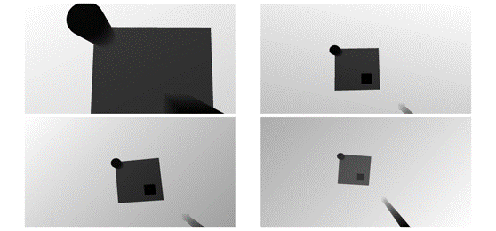
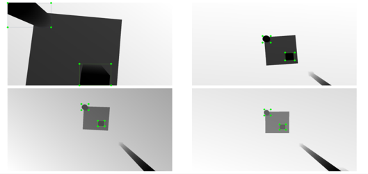
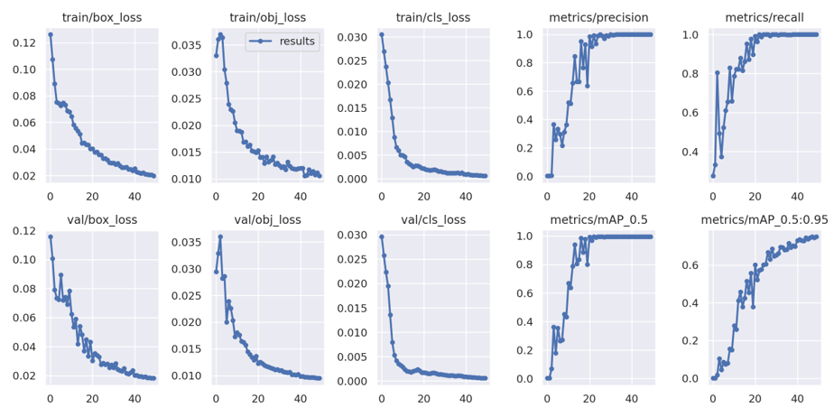
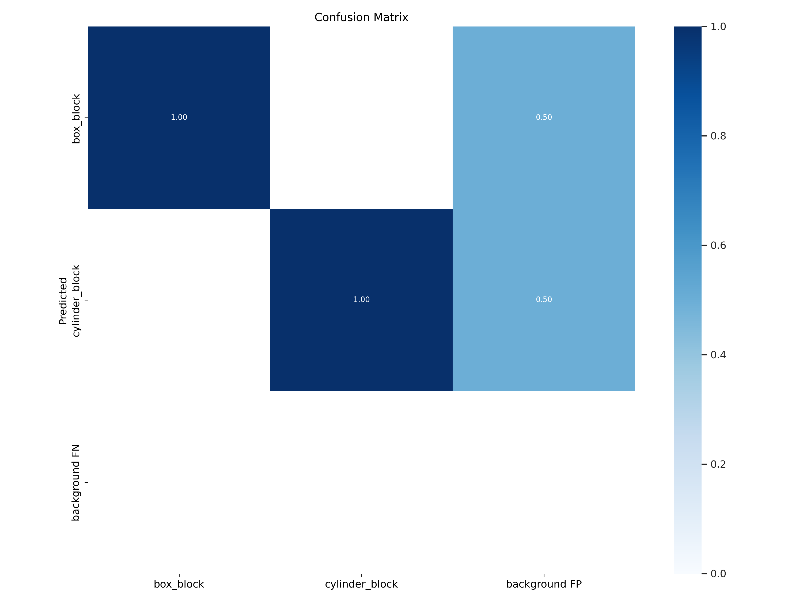
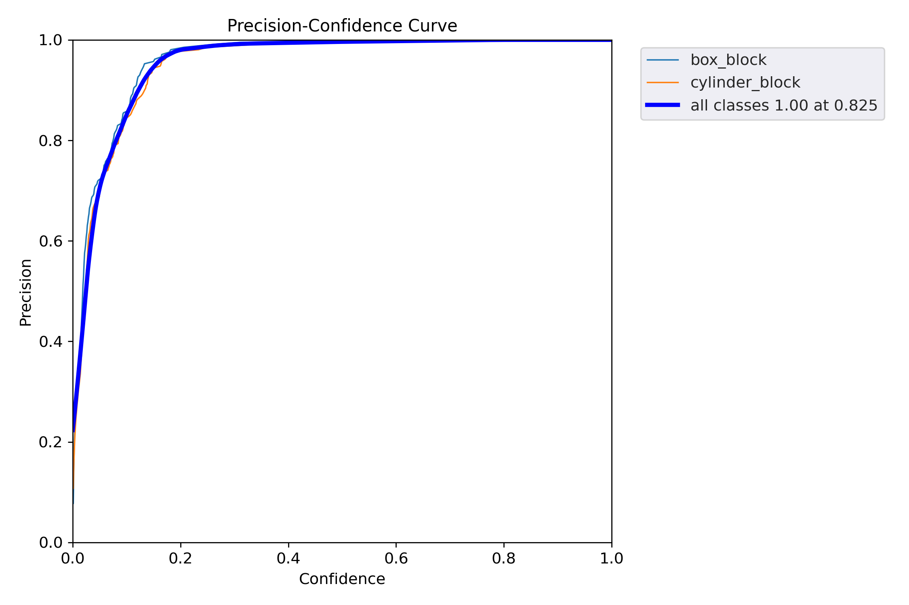
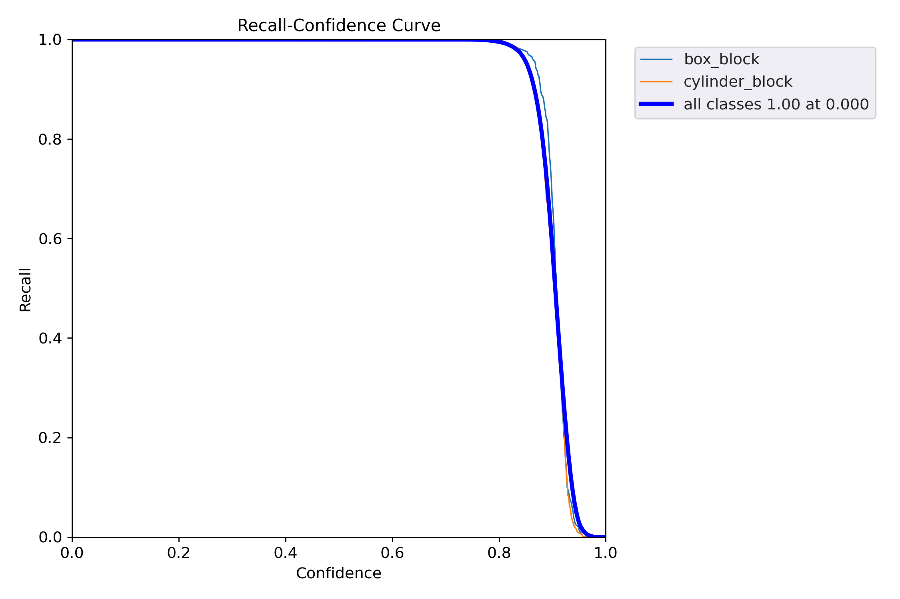
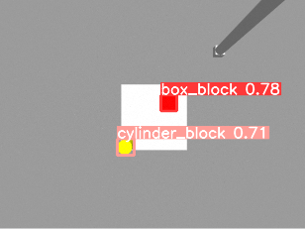
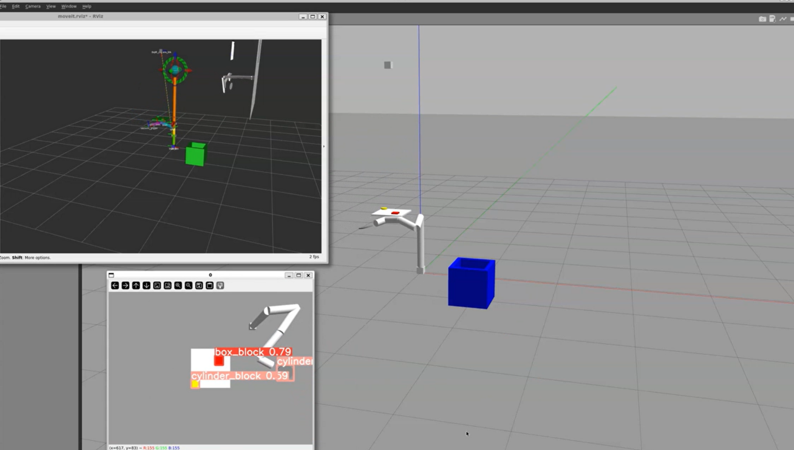

# Bin Picking Project

## Abstract
In this project, a robotic arm and its corresponding task environment were constructed within the Gazebo simulation environment. The robotic arm was integrated with the Moveit! framework for motion planning and control. Additionally, the YOLOv5 vision framework was incorporated to enhance the robotic system’s perception capabilities. The combined system successfully completed a bin picking task, demonstrating the effectiveness of the integration. This work highlights the potential of using advanced simulation environments and state-of-the-art vision frameworks to develop and test robotic applications in a controlled and efficient manner.

## Keywords
- Gazebo
- Moveit!
- YOLOv5

## 1. Motivation
The motivation for this project is to enhance automation, quality inspection, efficiency, and safety in industrial environments. Modern manufacturing demands automation for competitiveness. The robotic arm, integrated with the Moveit! framework, automates repetitive tasks, increasing throughput and reducing human error, leading to consistent production rates. Ensuring product quality is vital; the YOLOv5 vision framework and RGBD camera enable real-time inspections, detecting defects and verifying components to ensure high-quality products. Efficiency is boosted by the robotic arm’s continuous operation, with the vacuum gripper facilitating quick handling and optimized movements reducing cycle times. Safety is improved by using robots for hazardous tasks, reducing the risk of accidents. The robotic arm operates safely alongside humans with sensors to avoid collisions, minimizing exposure to dangerous conditions. This project leverages robotics and vision technologies to automate processes, improve quality, boost efficiency, and enhance safety, showing significant potential for innovation in manufacturing.

## 2. Environment

### 2.1 Robotic Arm
The implementation of the robotic arm involved constructing a seven-degree-of-freedom (7-DOF) robotic manipulator. Each of the seven rotational joints was meticulously designed to provide precise and flexible movement, ensuring the arm could achieve a wide range of positions and orientations required for complex tasks. The end-effector of the robotic arm was equipped with a vacuum gripper, chosen for its versatility and reliability in handling various objects with different shapes and sizes.

### 2.2 RGBD Camera
The RGBD camera system was constructed using a Gazebo plugin to create a comprehensive vision system. This camera is crucial for integrating with the YOLOv5 framework, providing the necessary image inputs for object detection and recognition tasks. The RGBD camera captures both color (RGB) and depth (D) information, significantly enhancing the perception capabilities of the robotic system.

## 3. Controlling and Planning

### 3.1 Controller Setup
A PID (Proportional-Integral-Derivative) controller is utilized for precise control of the robotic arm’s movements. The PID controller parameters were carefully tuned through iterative testing to achieve a balance between responsiveness, stability, and precision. This controller setup was accomplished using the Gazebo plugin, enabling real-time adjustments and testing under various conditions.

#### Table 1. PID Gains for Robotic Arm Joints
| Joint                   | Proportional Gain (P) | Integral Gain (I) | Derivative Gain (D) | Integral Clamp (I\_clamp) |
|-------------------------|-----------------------|-------------------|---------------------|---------------------------|
| Joint 1                 | 10000.0               | 100               | 0.1                 | 0.0                       |
| Joint 2                 | 10000.0               | 100               | 0.1                 | 0.0                       |
| Joint 3                 | 10000.0               | 100               | 0.1                 | 0.0                       |
| Joint 4                 | 10000.0               | 100               | 0.1                 | 0.0                       |
| Joint 5                 | 10000.0               | 100               | 0.1                 | 0.0                       |
| Joint 6                 | 10000.0               | 100               | 0.1                 | 0.0                       |
| Vacuum Gripper Joint    | 10000.0               | 100               | 0.1                 | 0.0                       |

### 3.2 Planning
The planning component of the robotic arm’s control system is primarily handled by the Moveit! framework, offering a robust set of motion planning algorithms. The integration of Moveit! allows for sophisticated motion planning and execution, ensuring that the arm can navigate complex environments, avoid obstacles, and perform tasks with high precision.

#### Planning Scene
The planning scene is visualized using RViz, a powerful 3D visualization tool that is part of the Robot Operating System (ROS) ecosystem. RViz provides an intuitive interface for visualizing the planning environment, the robotic arm’s movements, and other essential elements of the system. RViz allows users to create and visualize the entire planning scene, including the robot model, obstacles, and goal positions, helping to understand spatial relationships and planning constraints in real-time. Additionally, RViz can display the planned and executed trajectories of the robotic arm, enabling users to verify the correctness and efficiency of motion plans, which aids in debugging and optimizing the motion planning process. The tool can also display image data from the RGBD camera, providing a real-time view of the robot’s perception, crucial for vision-based control and object recognition tasks. Furthermore, RViz interfaces with various ROS topics and services, allowing for dynamic interaction with the robot and the environment. Users can monitor and control different aspects of the robotic system through these topics and services, facilitating seamless integration and control. By using RViz to visualize the planning scene, trajectories, and sensor data, developers gain a comprehensive overview of the robotic system’s operation, enhancing the development and testing process with real-time feedback and insights, and ensuring that the robotic arm performs accurately and efficiently in its tasks.

## 4. Vision System
The vision system enables the robotic arm to perform tasks such as object detection and recognition. By integrating the camera’s published topics into a trained YOLOv5 model, the system achieves real-time target detection, enhancing its ability to interact with the environment dynamically.

### 4.1 Data Acquisition
A diverse and representative dataset was acquired by continuously adjusting the camera’s pose to capture images of objects from different angles and distances. The RGBD camera collected 200 images, ensuring a comprehensive dataset that enhances the training process.

*Fig 1. Data Acquisition: RGBD camera capturing images from various angles and distances in the Gazebo environment.*

*Fig 2. Data Annotation: Manually labeling the dataset to identify and classify objects.*

### 4.2 Model Training
The collected dataset was used to train the YOLOv5 model. Starting with a pre-trained YOLOv5 model, it was fine-tuned using the acquired dataset to improve accuracy and efficiency in object detection.

*Fig 3. Model Training: Fine-tuning the pre-trained YOLOv5 model with the annotated dataset.*

*Fig 4. Confusion Matrix: Evaluating the performance of the trained YOLOv5 model.*

*Fig 5. Precision-Confidence Curve: Analysis of the precision at various confidence levels.*

*Fig 6. Recall-Confidence Curve: Analysis of the recall at various confidence levels.*

### 4.3 Camera Calibration
Camera calibration ensures accurate depth and spatial measurements. The calibration process involves determining the camera’s intrinsic and extrinsic parameters to align visual data correctly with the robot’s coordinate system.

*Fig 7. Camera Calibration: Setting intrinsic and extrinsic parameters for accurate depth and spatial measurements.*

### 4.4 Detection
With the camera calibrated and the YOLOv5 model trained, the vision system performs real-time object detection. The camera continuously publishes image data, which is processed by the YOLOv5 model to detect and locate objects within the scene.

*Fig 8. Real-time Detection: The YOLOv5 model detecting and annotating objects with bounding boxes and class labels.*

## 5. Integrated System and Bin Picking Task
The final stage involved integrating the vision system, control system, and planning system within the Gazebo environment to accomplish the bin picking task. The RGBD camera’s data, YOLOv5 detection model, PID controller, and Moveit! planning framework were integrated to perform bin picking, specifically targeting red blocks and placing them into a blue bin.

*Fig 9. Integrated System: The robotic arm performing the bin picking task by moving a red block to a blue bin within the Gazebo environment.*

## 6. Limitations and Future Work

### 6.1 Limitations
The current setup has several limitations. The vacuum gripper can only handle small objects, limiting the range of tasks it can perform. Additionally, the task environment is relatively simple, involving only two object categories.

### 6.2 Future Work
Future work could expand the system’s capabilities by implementing a gripper mechanism to handle a broader range of objects and exploring more complex task environments involving multiple object categories and real-time multi-class object recognition.

## References
1. Jiaxin Guo, Lian Fu, Mingkai Jia, Kaijun Wang, and Shan Liu. Fast and robust bin-picking system for densely piled industrial objects. In 2020 Chinese Automation Congress (CAC), pages 2845–2850. IEEE, 2020.
2. Sertac Karaman, Matthew R Walter, Alejandro Perez, Emilio Frazzoli, and Seth Teller. Anytime motion planning using the RRT. In 2011 IEEE international conference on robotics and automation, pages 1478–1483. IEEE, 2011.
3. Sunil Kumar and Afzal Sikander. A modified probabilistic roadmap algorithm for efficient mobile robot path planning. Engineering Optimization, 55(9):1616–1634, 2023.
4. Joseph Redmon, Santosh Divvala, Ross Girshick, and Ali Farhadi. You only look once: Unified, real-time object detection. In Proceedings of the IEEE Conference on Computer Vision and Pattern Recognition (CVPR), June 2016.
5. Muhammad Hamza Zafar, Hassaan Bin Younus, Syed Kumayl Raza Moosavi, Majad Mansoor, and Filippo Sanfilippo. Online PID tuning of a 3-DOF robotic arm using a metaheuristic optimization algorithm: A comparative analysis. In International Conference on Information and Software Technologies, pages 25–37. Springer, 2023.
